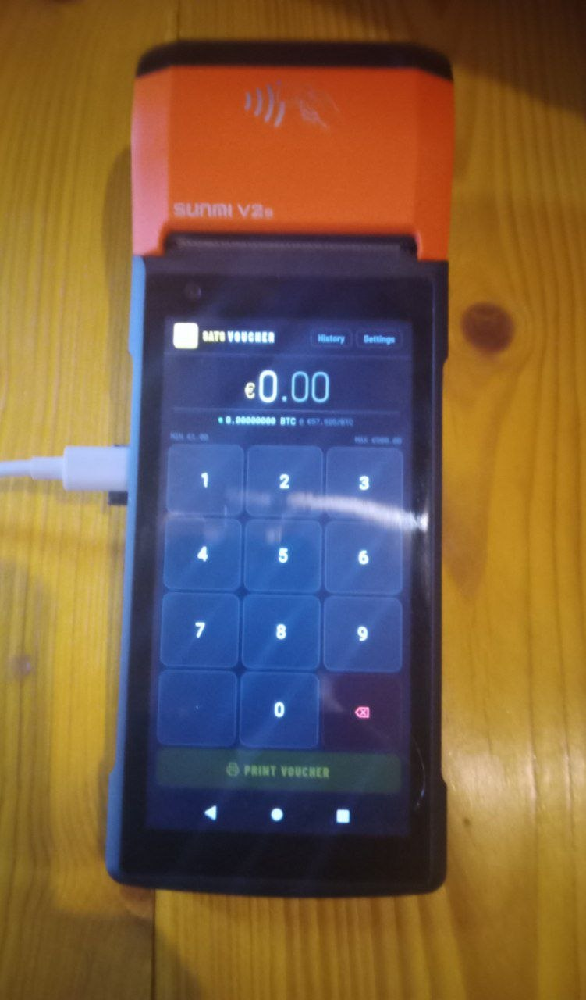
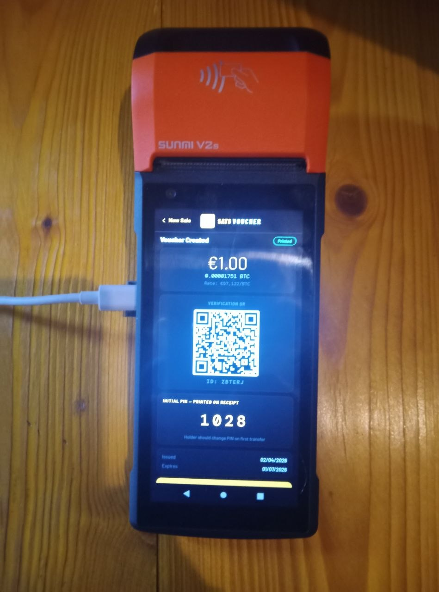
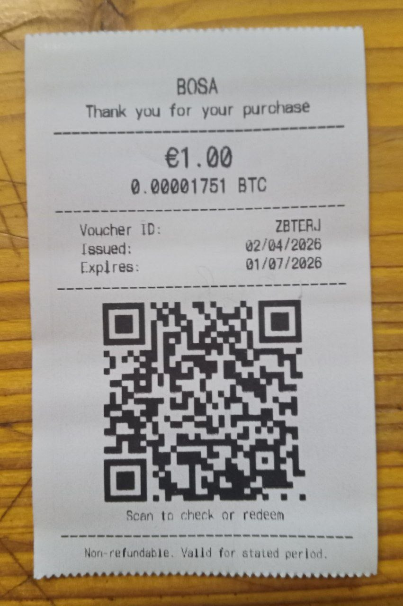
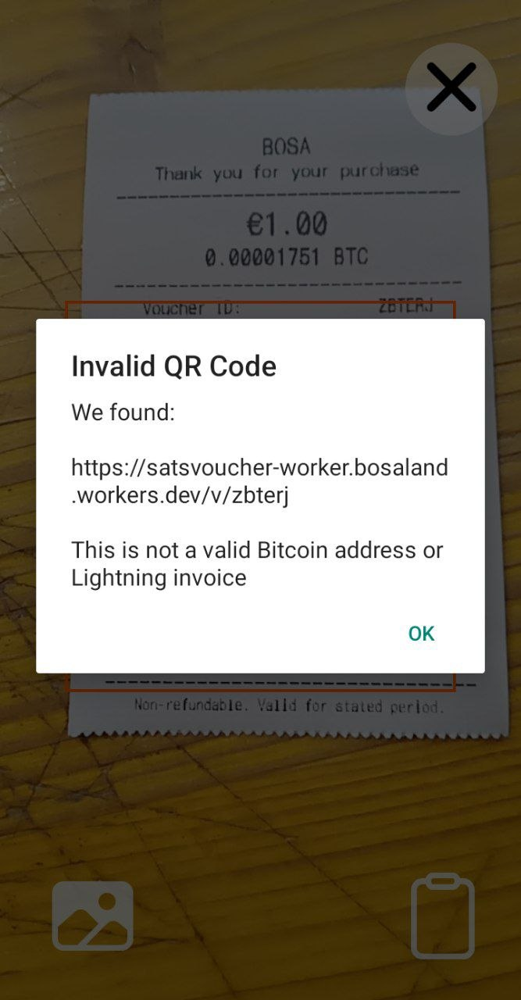
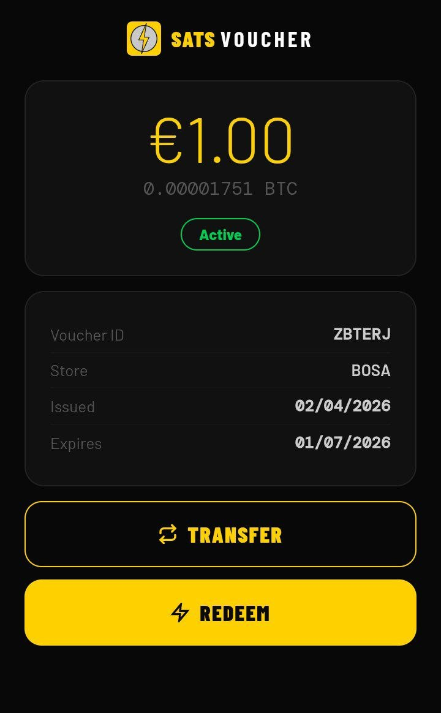
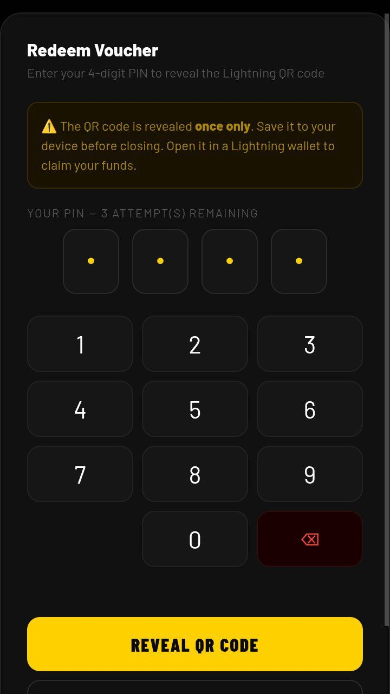
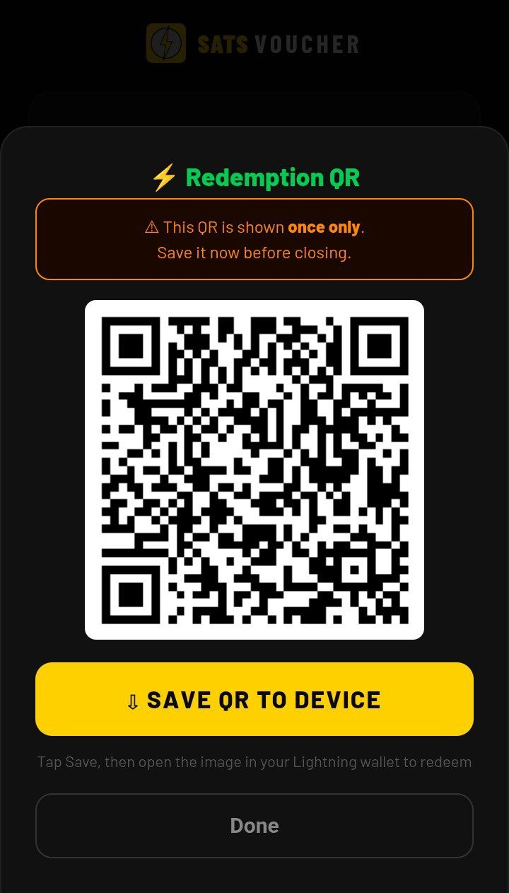
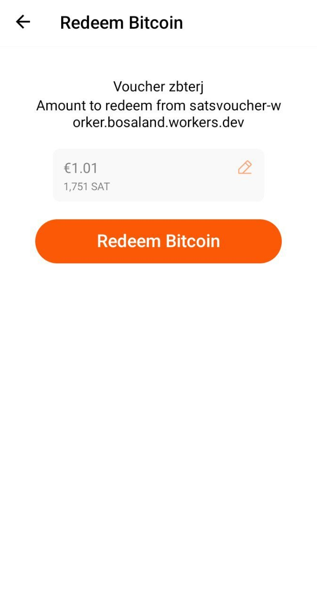
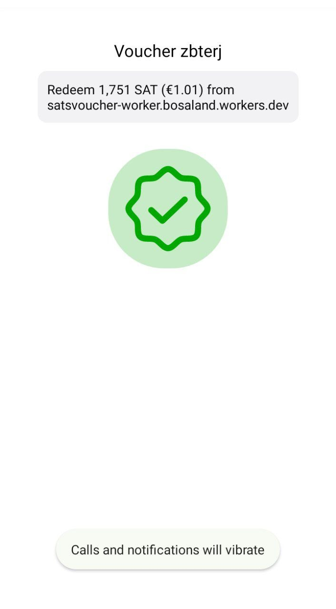
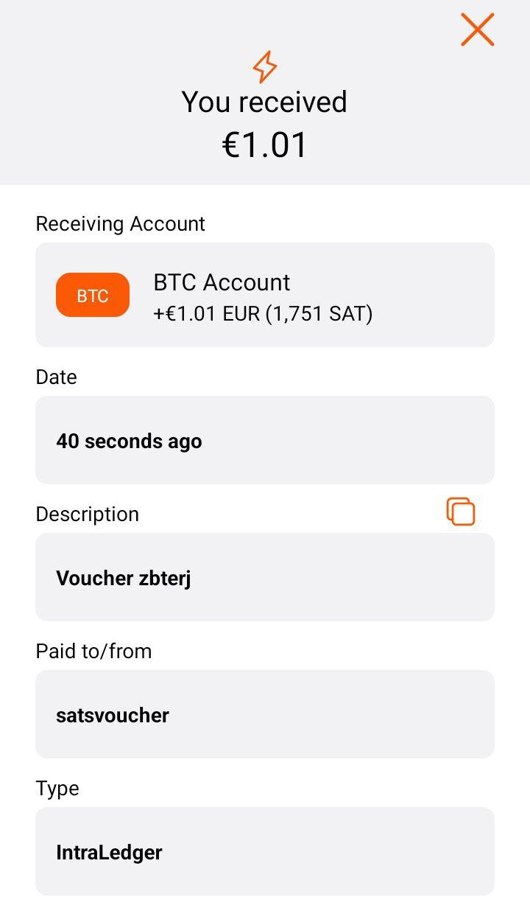

# Story 1 — The First Real Voucher

*How a wait for hardware parts turned into a working Bitcoin Lightning voucher system*

---

## It Started With a Parts Delay

Earlier this year I was working on a Bitcoin hardware project and waiting for some components to arrive. I had a Sunmi V2S POS terminal sitting on my desk, a Blink wallet, and some time. The question I kept coming back to was simple: can a small retail merchant issue a Bitcoin voucher the same way they issue a gift card — printed, physical, handed over the counter?

The answer turned out to be yes. This is the story of how SatsVOUCHER went from idle idea to first production transaction.

---

## What Is SatsVOUCHER?

SatsVOUCHER is a Bitcoin Lightning voucher platform for retail. A merchant issues a voucher at point of sale — the customer gets a printed receipt with a QR code and a 4-digit PIN. They can verify it, transfer it to someone else, or redeem it directly to any Lightning wallet. No app required. No account. No friction.

The whole platform runs as a single Cloudflare Worker backed by a Blink wallet. One JavaScript file. One deployment. Everything included.

The Blink API does the heavy lifting on the payment side — the Worker calls Blink to create LNURL-withdraw requests on demand and pay Lightning invoices when customers redeem. Without a solid, reliable Lightning API this project would not have been possible.

---

## The Hardware

The terminal is a **Sunmi V2S** — an Android POS device with a built-in 58mm thermal printer and NFC reader. It is widely used in retail across Europe and Asia. The web app runs inside a custom Android bridge APK that exposes the printer to the web app via a localhost HTTP API. The merchant never installs anything — the web app is served directly from the Cloudflare Worker.

*The SatsVOUCHER merchant app running on the Sunmi V2S. The keypad is the entire sale interface — enter the amount, hand the device to the customer.*

---

## Creating the First Voucher

The merchant enters the amount on the keypad. The live BTC price feeds from CoinGecko and converts the fiat amount to sats in real time. Tap **Print Voucher**.

The Worker generates a unique voucher ID, creates a 4-digit PIN hashed with SHA-256 and a random salt using the Web Crypto API built into the Workers runtime, and stores everything in Cloudflare KV. The PIN is never stored in plain text — only the hash.

The confirm screen loads and is handed to the customer.

*The first production voucher — €1.00 of sats. The 4-digit PIN is displayed once on screen. It is never printed on the receipt. The customer writes it on the back themselves.*

---

## The Printed Receipt

The customer taps **Print Receipt**. The Sunmi thermal printer produces a receipt with the voucher amount, issue and expiry dates, voucher ID, and a QR code pointing to the verification page at `/v/{id}`. The PIN is deliberately absent from the printed receipt — only the customer who saw the screen knows it.

*The first printed voucher. QR code, voucher ID, dates, amount. Clean and simple — exactly what you would expect from a gift card.*

---

## The Voucher Cannot Be Redeemed Directly

This is an important design decision. The QR code on the receipt does **not** encode a Lightning invoice or LNURL-withdraw directly. If you scan it with a Lightning wallet, nothing happens.

*Scanning the printed QR with a Lightning wallet does nothing. The QR points to the verification page, not a payment request. This is intentional.*

The reason is security. A printed LNURL-withdraw is a bearer instrument with no protection — anyone who photographs the receipt could drain the funds. SatsVOUCHER requires the 4-digit PIN before the LNURL is ever created. The LNURL-withdraw is generated on demand at the moment of redemption, exposed exactly once, and never stored.

---

## Verify and Redeem

Scanning the QR code with any phone camera opens the verification page in the browser. No app, no account, no friction. The page shows the voucher status, amount, and expiry date. Two buttons: **Transfer** and **Redeem**.

*Scan the QR with any phone camera. The verification page opens instantly in the browser. Voucher status, amount, expiry — all live from KV.*

Tapping **Redeem** opens a PIN entry screen. The customer enters their 4-digit PIN. Three failed attempts triggers a 24-hour lockout. The PIN is verified against the stored hash on the Worker — never transmitted in plain text.

*4-digit PIN entry. Max 3 attempts. 24-hour lockout on failure. The PIN never leaves the device in plain text — it is hashed client-side before verification.*

On a correct PIN, the Worker calls the Blink API to create an LNURL-withdraw request. The QR is displayed once. A prominent warning reminds the customer this is a one-time event — save it before closing.

*The redemption QR revealed. One time only. The customer saves it to their device using the download button — standard Android download manager handles it cleanly.*

---

## Redeem in Blink

The customer opens their Blink wallet and taps **Scan**. They scan the saved QR from their photos.

*Blink recognises the LNURL-withdraw instantly. A new screen opens showing the amount available to redeem. One tap — Redeem Bitcoin.*

---

## Success

The funds arrive in the Blink wallet in seconds. The voucher status in KV updates to **Redeemed** via the LNURL-withdraw callback. The verification page reflects the new status immediately.

*Redeemed. The Lightning payment settles in seconds. The voucher is now permanently marked as redeemed in KV — it cannot be used again.*

*The transaction appears in the Blink wallet history. €1.00 of sats received. First production voucher — complete.*

---

## What the Blink API Does Here

The integration is straightforward but essential. The Worker uses two Blink GraphQL calls:

**LNURL-withdraw handshake** — when a customer redeems, the Worker serves LNURL-withdraw parameters including a callback URL. The customer's Lightning wallet hits this endpoint automatically.

**Invoice payment** — the LNURL-withdraw callback receives the Lightning invoice from the customer's wallet and calls `lnInvoicePaymentSend` on the Blink API to pay it from the merchant's wallet.

That is the complete payment flow. Two API calls, no intermediate hops, no channel management, no liquidity concerns. The Blink API abstracts all of that cleanly.

The bech32 encoding for LNURL is implemented inline in the Worker — no external dependencies. The entire platform has zero npm packages.

---

## Where This Goes Next

The first production voucher proves the concept works end to end. The immediate next steps are a public trial with real customers, then merchant onboarding for other locations.

The longer roadmap includes **SatsCASH** — a physical NFC coin system using the same Worker and Blink infrastructure. The NFC bridge is already built into the Android APK. A coin holds a balance keyed by NFC tag UID in KV. Tap to mint, tap to redeem. Same Lightning settlement, physical bearer instrument.

The goal is simple: make it as easy to spend Bitcoin in a shop as it is to spend cash. SatsVOUCHER is the first piece of that infrastructure.

---

## Code and Platform

The full platform is open source.

**GitHub:** [github.com/blankworker1/SatsVOUCHER](https://github.com/blankworker1/SatsVOUCHER)

**Live platform:** [satsvoucher-worker.bosaland.workers.dev](https://satsvoucher-worker.bosaland.workers.dev)

Built with: Cloudflare Workers · Cloudflare KV · Blink API · Sunmi V2S · Android

---

*Questions and feedback welcome. If you are a merchant interested in running SatsVOUCHER at your location, merchant onboarding will be available after the current public trial.*
